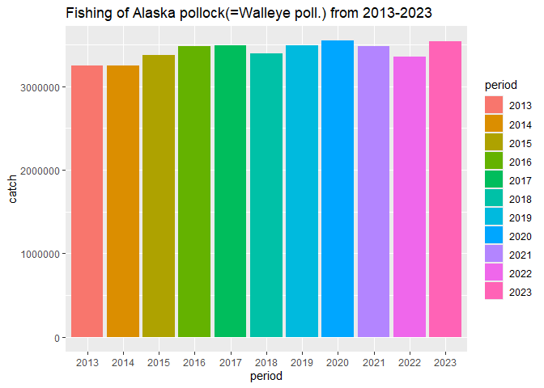
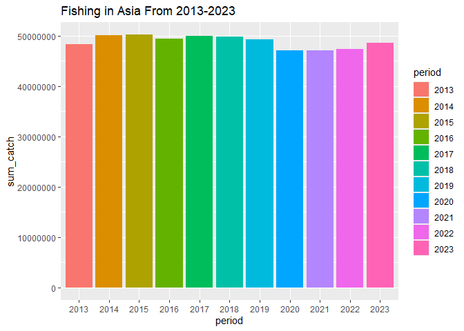

## Instructions
Answer the following questions and/or complete the exercises in RMarkdown. Please embed all of your code and push the final work to your repository. Your report should be organized, clean, and run free from errors. Remember, you must remove the `#` for any included code chunks to run.  

## Load the libraries

``` r
library("tidyverse")
library("janitor")
#library("naniar")
options(scipen = 999)
```

## About the Data
For this assignment we are going to work with a data set from the [United Nations Food and Agriculture Organization](https://www.fao.org/fishery/en/collection/capture) on world fisheries. These data were downloaded and cleaned using the `fisheries_clean.Rmd` script.  

Load the data `fisheries_clean.csv` as a new object titled `fisheries_clean`.

``` r
fisheries_clean <- read_csv("data/fisheries_clean.csv")
```

1. Explore the data. What are the names of the variables, what are the dimensions, are there any NA's, what are the classes of the variables, etc.? You may use the functions that you prefer.

``` r
names(fisheries_clean)
```

```
## [1] "period"          "continent"       "geo_region"      "country"        
## [5] "scientific_name" "common_name"     "taxonomic_code"  "catch"          
## [9] "status"
```


``` r
dim(fisheries_clean)
```

```
## [1] 1055015       9
```


``` r
glimpse(fisheries_clean) #finding the classes of the variables
```

```
## Rows: 1,055,015
## Columns: 9
## $ period          <dbl> 1950, 1951, 1952, 1953, 1954, 1955, 1956, 1957, 1958, …
## $ continent       <chr> "Asia", "Asia", "Asia", "Asia", "Asia", "Asia", "Asia"…
## $ geo_region      <chr> "Southern Asia", "Southern Asia", "Southern Asia", "So…
## $ country         <chr> "Afghanistan", "Afghanistan", "Afghanistan", "Afghanis…
## $ scientific_name <chr> "Osteichthyes", "Osteichthyes", "Osteichthyes", "Ostei…
## $ common_name     <chr> "Freshwater fishes NEI", "Freshwater fishes NEI", "Fre…
## $ taxonomic_code  <chr> "1990XXXXXXXX106", "1990XXXXXXXX106", "1990XXXXXXXX106…
## $ catch           <dbl> 100, 100, 100, 100, 100, 200, 200, 200, 200, 200, 200,…
## $ status          <chr> "A", "A", "A", "A", "A", "A", "A", "A", "A", "A", "A",…
```

``` r
#how to find if there are NAs?
```

2. Convert the following variables to factors: `period`, `continent`, `geo_region`, `country`, `scientific_name`, `common_name`, `taxonomic_code`, and `status`.

``` r
fisheries_clean <- fisheries_clean %>% 
  mutate(across(c(period, continent,geo_region,country,scientific_name,common_name,taxonomic_code,status),as.factor))
```

##3. Are there any missing values in the data? If so, which variables contain missing values and how many are missing for each variable?

``` r
#skip this question
```

4. How many countries are represented in the data?

``` r
fisheries_clean %>% 
  distinct(country)
```

```
## # A tibble: 249 × 1
##    country            
##    <fct>              
##  1 Afghanistan        
##  2 Albania            
##  3 Algeria            
##  4 American Samoa     
##  5 Andorra            
##  6 Angola             
##  7 Anguilla           
##  8 Antigua and Barbuda
##  9 Argentina          
## 10 Armenia            
## # ℹ 239 more rows
```
249 countries.

5. The variables `common_name` and `taxonomic_code` both refer to species. How many unique species are represented in the data based on each of these variables? Are the numbers the same or different?

``` r
fisheries_clean %>% 
  select(common_name, taxonomic_code) %>% 
  n_distinct()
```

```
## [1] 3722
```

6. In 2023, what were the top five countries that had the highest overall catch?

``` r
fisheries_clean %>% 
  filter(period=="2023") %>% 
  group_by(country) %>% 
  summarize(sum_catch=sum(catch)) %>% 
  arrange(desc(sum_catch)) %>% 
  slice_max(sum_catch, n=5)
```

```
## # A tibble: 5 × 2
##   country                  sum_catch
##   <fct>                        <dbl>
## 1 China                    13424705.
## 2 Indonesia                 7820833.
## 3 India                     6177985.
## 4 Russian Federation        5398032 
## 5 United States of America  4623694
```

7. In 2023, what were the top 10 most caught species? To keep things simple, assume `common_name` is sufficient to identify species. What does `NEI` stand for in some of the common names? How might this be concerning from a fisheries management perspective?

``` r
fisheries_clean %>% 
  filter(period=="2023") %>% 
  group_by(common_name) %>% 
  summarize(sum_catch=sum(catch)) %>%  
  arrange(desc(sum_catch))  
```

```
## # A tibble: 2,870 × 2
##    common_name                    sum_catch
##    <fct>                              <dbl>
##  1 Marine fishes NEI               8553907.
##  2 Freshwater fishes NEI           5880104.
##  3 Alaska pollock(=Walleye poll.)  3543411.
##  4 Skipjack tuna                   2954736.
##  5 Anchoveta(=Peruvian anchovy)    2415709.
##  6 Blue whiting(=Poutassou)        1739484.
##  7 Pacific sardine                 1678237.
##  8 Yellowfin tuna                  1601369.
##  9 Atlantic herring                1432807.
## 10 Scads NEI                       1344190.
## # ℹ 2,860 more rows
```
NEI stands for Not elsewhere included meaning some of the fishes that are labled NEI are not recording what species or what categories the type of catch belongs in. If fisheries record fish that are not categorized it would be difficult to look at data overtime and effects on fishing in certain areas. 


``` r
# fisheries_clean %>% 
#   select(period, catch, country, common_name) %>% 
#   filter(period=="2023") %>% 
#   group_by(country, common_name) %>% #sums up the total catches of each species for each country
#   summarize(sum_catch=sum(catch)) %>% 
#   arrange(desc(sum_catch))
```

8. For the species that was caught the most above (not NEI), which country had the highest catch in 2023?

``` r
fisheries_clean %>% 
  filter(common_name=="Alaska pollock(=Walleye poll.)") %>% 
  filter(period=="2023") %>% 
  group_by(country,common_name) %>% 
  summarize(sum_catch=sum(catch)) %>% 
  arrange(desc(sum_catch))
```

```
## `summarise()` has grouped output by 'country'. You can override using the
## `.groups` argument.
```

```
## # A tibble: 6 × 3
## # Groups:   country [6]
##   country                               common_name                    sum_catch
##   <fct>                                 <fct>                              <dbl>
## 1 Russian Federation                    Alaska pollock(=Walleye poll.)  1893924 
## 2 United States of America              Alaska pollock(=Walleye poll.)  1433538 
## 3 Japan                                 Alaska pollock(=Walleye poll.)   122900 
## 4 Democratic People's Republic of Korea Alaska pollock(=Walleye poll.)    58730 
## 5 Republic of Korea                     Alaska pollock(=Walleye poll.)    28432.
## 6 Canada                                Alaska pollock(=Walleye poll.)     5887.
```
In 2023, the Russian Federation had the highest catch of Alaska Pollock(=Walleye poll.).

9. How has fishing of this species changed over the last decade (2013-2023)? Create a  plot showing total catch by year for this species.

``` r
fisheries_clean %>% 
  filter(common_name=="Alaska pollock(=Walleye poll.)") %>% 
  # filter(period=="2013" | period=="2014" | period=="2015"| period=="2016"| period=="2017"| period=="2018"| period=="2019"| period=="2020"| period=="2021"| period=="2022"| period=="2023") %>% 
  filter(period %in% c(2013,2014,2015,2016,2017,2018,2019,2020,2021,2022,2023)) %>% 
  ggplot(aes(x=period, y=catch))+
  geom_col(mapping=aes(fill=period))+
  labs(title="Fishing of Alaska pollock(=Walleye poll.) from 2013-2023")
```

<!-- -->

10. Perform one exploratory analysis of your choice. Make sure to clearly state the question you are asking before writing any code.

``` r
#Which continent caught the most fish in 2023 and make a plot of how fishing has changed over the past decade for that continent. 
fisheries_clean %>% 
  filter(period=="2023") %>% 
  group_by(continent) %>% 
  summarize(sum_catch=sum(catch)) %>% 
  arrange(desc(sum_catch))
```

```
## # A tibble: 6 × 2
##   continent sum_catch
##   <fct>         <dbl>
## 1 Asia      48578981.
## 2 Americas  17375444.
## 3 Europe    14430135.
## 4 Africa    10711862.
## 5 Oceania    1581909.
## 6 <NA>         46166.
```


``` r
fisheries_clean %>% 
  filter((period %in% c(2013,2014,2015,2016,2017,2018,2019,2020,2021,2022,2023)), 
         (continent=="Asia")) %>% 
  group_by(period) %>% 
  summarize(sum_catch=sum(catch)) %>% 
  ggplot(aes(x=period, y=sum_catch))+
  geom_col(mapping=aes(fill=period))+
  labs(title="Fishing in Asia From 2013-2023")
```

<!-- -->

## Knit and Upload
Please knit your work as an .html file and upload to Canvas. Homework is due before the start of the next lab. No late work is accepted. Make sure to use the formatting conventions of RMarkdown to make your report neat and clean!  
